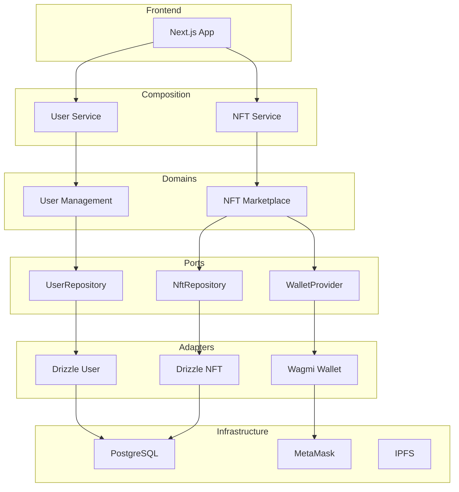

# Kompo Studio - Visualisez votre Architecture

Kompo Studio est l'outil visuel qui vous permet de comprendre, explorer et maintenir votre architecture hexagonale en temps réel.

## Qu'est-ce que Kompo Studio ?

Kompo Studio est une interface web qui :
- **Visualise** l'architecture de vos domains
- **Explore** les dépendances entre ports et adapters
- **Documente** automatiquement votre stack
- **Diagnostique** les problèmes d'architecture

::: tip
Kompo Studio est inclus dans chaque projet Kompo. Lancez-le avec `pnpm studio`.
:::

## Démarrage Rapide

```bash
# Depuis votre projet Kompo
pnpm studio

# Ou avec npx
npx @kompo/cli studio
```

Ouvrez [http://localhost:3001](http://localhost:3001) pour voir votre architecture !

## Features Principales

### 🎨 Architecture Graph

Visualisez votre architecture complète :



### 📊 Stack Inspector

Explorez chaque couche de votre stack :

**Domains**
- Liste de tous les domains
- Entités et value objects
- Use cases et ports
- Métriques de complexité

**Ports & Adapters**
- Mapping ports → adapters
- Dependencies externes
- Performance des adapters
- Health checks

**Composition**
- Services exposés
- Wiring des dépendances
- Points d'entrée API
- Configuration

### 🔍 Dependency Explorer

Analysez les dépendances de votre architecture :

```typescript
// Exemple d'analyse générée
Dependency Analysis:
├── user-management domain
│   ├── Uses: UserRepositoryPort
│   └── Depends on: 0 other domains
├── nft-marketplace domain  
│   ├── Uses: NftRepositoryPort, WalletPort, MetadataPort
│   └── Depends on: user-management (owner info)
└── payment-processing domain
    ├── Uses: PaymentGatewayPort
    └── Depends on: nft-marketplace (NFT pricing)
```

### 📝 Documentation Auto-générée

Kompo Studio génère automatiquement :

**API Docs**
```typescript
// Documentation générée depuis les use cases
POST /api/users/create
Body: CreateUserInput
Response: User

POST /api/nfts/mint  
Body: MintNftInput
Response: { nft: Nft, transactionHash: string }
```

**Domain Documentation**
```markdown
## User Management Domain

### Purpose
Gère l'authentification et les profils utilisateurs.

### Entities
- **User**: Profil utilisateur avec wallet
- **UserProfile**: Informations publiques

### Use Cases
- **authenticateUser**: Connecte un utilisateur via wallet
- **updateProfile**: Met à jour le profil
- **deleteAccount**: Supprime un compte

### Ports Required
- UserRepositoryPort: Persistence des utilisateurs
- WalletPort: Interactions blockchain
```

### 🏥 Health Dashboard

Surveillance de la santé de votre système :

```typescript
Health Status:
├── Database: ✅ Connected (23ms latency)
├── Redis: ✅ Connected (5ms latency)  
├── IPFS: ✅ Connected (150ms latency)
├── RPC Node: ⚠️ Slow (850ms latency)
└── External APIs: ✅ All healthy
```

## Navigation dans Studio

### Sidebar Navigation

```
🏠 Dashboard
├── 📊 Overview
├── 🏥 Health
└── 📈 Metrics

🏗️ Architecture  
├── 🎨 Graph View
├── 📋 List View
└── 🔍 Dependencies

📚 Documentation
├── 📖 Domains
├── 🔌 Ports
├── 🔧 Adapters
└── 📡 APIs

⚙️ Settings
├── 🎨 Theme
├── 📊 Filters
└── 🔔 Alerts
```

### Views Disponibles

**Graph View**
- Visualisation interactive
- Zoom et pan
- Cliquez sur les nœuds pour détails
- Filtrez par type/domain

**List View**  
- Tableau détaillé
- Tri et recherche
- Export CSV/JSON
- Mode compact/étendu

**Code View**
- Code source des entities
- Interface des ports
- Implémentation des adapters
- Syntax highlighting

## Personnalisation

### Thèmes

```typescript
// kompo.studio.config.ts
export default {
  theme: 'dark', // ou 'light', 'auto'
  colors: {
    primary: '#8b5cf6',
    secondary: '#06b6d4',
    accent: '#10b981'
  },
  layout: {
    sidebar: 'expanded', // ou 'collapsed'
    showMetrics: true,
    showHealth: true
  }
}
```

### Plugins

Kompo Studio est extensible avec des plugins :

```typescript
// plugins/analytics.ts
export const analyticsPlugin = {
  name: 'Analytics',
  component: AnalyticsDashboard,
  routes: ['/analytics'],
  menu: {
    group: 'Analytics',
    items: [
      { label: 'Overview', href: '/analytics' },
      { label: 'Performance', href: '/analytics/performance' }
    ]
  }
}
```

## Intégration CI/CD

### Screenshots automatiques

```yaml
# .github/workflows/docs.yml
- name: Generate Architecture Docs
  run: |
    pnpm studio screenshot --output docs/architecture.png
    pnpm studio export --format markdown --output docs/api.md

- name: Upload to Wiki
  uses: actions/upload-artifact@v3
  with:
    name: architecture-docs
    path: docs/
```

### Architecture as Code

```typescript
// studio.config.ts
export const architectureConfig = {
  domains: {
    'user-management': {
      complexity: 'low',
      stability: 100,
      coverage: 95
    },
    'nft-marketplace': {
      complexity: 'high', 
      stability: 85,
      coverage: 88
    }
  },
  rules: {
    'no-domain-dependencies': true,
    'max-complexity': 80,
    'min-coverage': 90
  }
}
```

## Bonnes Pratiques

### Documentation

::: tip ✅ Documentez avec Studio :
- Générez les docs API automatiquement

    - Exportez les graphiques pour les présentations

    - Utilisez les tags pour marquer les domains

    - Ajoutez des descriptions aux use cases
:::

### Monitoring

```typescript
// Configurez les alerts dans Studio
{
  alerts: {
    'high-latency': {
      threshold: 500, // ms
      channels: ['slack', 'email']
    },
    'error-rate': {
      threshold: 5, // %
      channels: ['slack']
    }
  }
}
```

### Collaboration

- **Share Links** : Partagez des vues spécifiques
- **Comments** : Ajoutez des notes sur l'architecture  
- **Versions** : Comparez les architectures dans le temps
- **Export** : PDF, PNG, Markdown pour la documentation

## Exemples d'Utilisation

### Onboarding

Nouveaux membres de l'équipe :
1. Ouvrent Kompo Studio
2. Parcourent le graph d'architecture
3. Lisent la documentation des domains
4. Comprendent les flux de données

### Reviews de Code

Avant de merger :
1. Vérifiez l'impact sur l'architecture
2. Validez les nouvelles dépendances
3. Assurez-vous de la cohérence

### Architecture Reviews

Trimestriel :
1. Exportez les métriques
2. Identifiez les domains complexes
3. Planifiez les refactors
4. Documentez les décisions

## Roadmap

### Prochaines features

- **Real-time Updates** : WebSocket pour voir les changements en direct
- **AI Assistant** : Suggestions d'optimisation d'architecture
- **Team Mode** : Collaboration multi-utilisateurs
- **Export Formats** : PlantUML, Mermaid, C4 models
- **Integration** : GitHub, GitLab, Jira

::: tip
**Besoin d'une feature ?** Votez sur notre GitHub Issues.
:::

Kompo Studio transforme votre architecture complexe en une visualisation claire et maintenable. Essayez-le dès maintenant !
